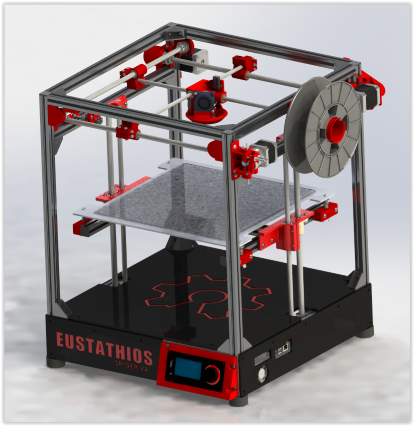
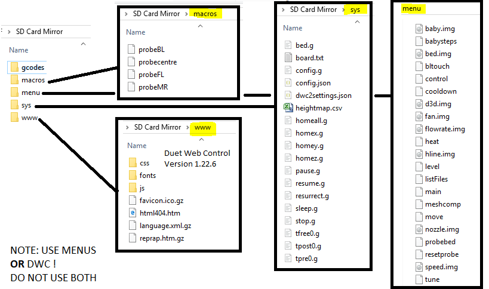
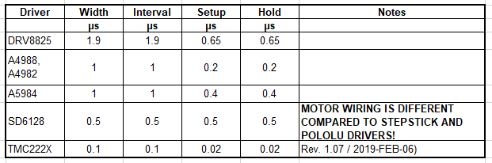
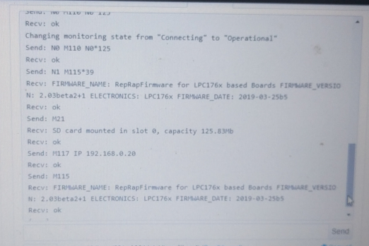
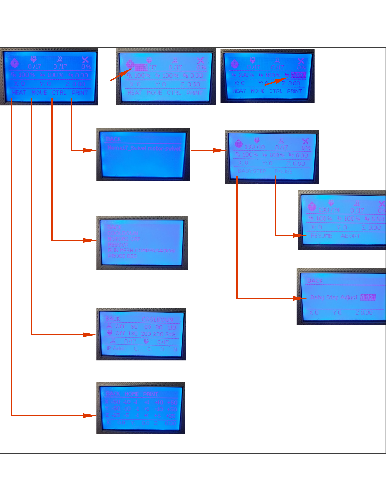
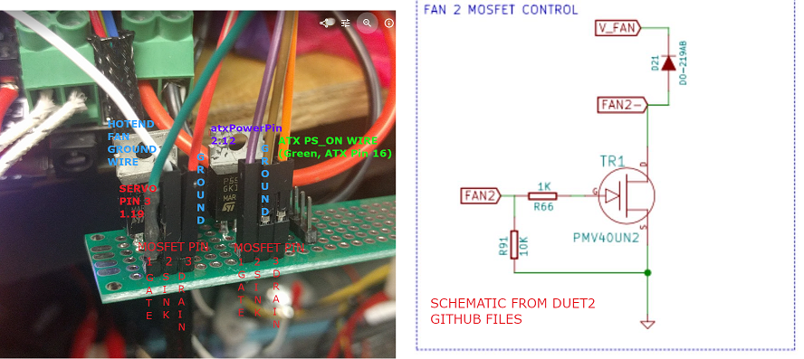

# LPC1768-RepRapFirmware-Files
ReARM config files for using sdavi's port of RepRapFirmware: https://github.com/sdavi/RepRapFirmware

This is an experimental port of dc42's RepRapFirmware for LPC1768/LPC1769 based boards.
These are Panucatt Re-Arm, Azteeg X5 MiniWiFi, SKR, maybe some others.   
...

Note: This firmware does not show up as a mass storage device when connected to a computer. Physical access to the internal sdcard IS required in order to revert back or update. More on that later. 

My printer- https://github.com/eclsnowman/Eustathios-Spider-V2  
Eustathios Version 2. Cartesian gantry printer.   
Discussion moved from G+ (RIP) to https://forum.makerforums.info/c/herculien

ReArm with Ramps 1.4, SD2224 for X & Y, and DVR8825 for Z & Extruder
Piezo probe at the hotend. 

WHY:
Marlin 2.0 was not consistently stable for me. Even though I was using 1.1.x for over a year, the move to 2.0 was NOT smooth or reliable. Even the developers say Marlin 2.0 is not ready for prime time. 

Why not Smoothieware: lets just say my first and only visit to the #smoothieware irc channel, where I asked for clarification of their docs, was so offensive, that I could not see my way to supporting their work, EVER.

So looking at the landscape, there really wasn't much to be lost but everything to be gained by running the Experiemntal port of LPC1768 RepRapFirmware. The RepRap.org forum discussion is here-

https://reprap.org/forum/read.php?147,810214

--------------------------------------------------------

I am putting my notes here as I go, hopefully to aid someone else and maybe use as a basis for formal documentation later. 

0. READ THIS BEFORE YOU BEGIN! 
  https://duet3d.dozuki.com/Wiki/Firmware_Overview
  
  Pay attention to the bits at the end " Firmware differences from Marlin, Repetier etc" and "Known firmware issues and limitations"
  
  The quick start guide has lots of helpful info too- https://duet3d.dozuki.com/#Section_Quick_Links
  
  Here is a a machine comissioning guide that I found helpful, even though I found it after I needed it. 
  https://docs.google.com/document/d/1k_3IYuRaRNjBqNOff-AcdCPjyf0nLv5rsSWXWlQVxSw/pub

1. Get the port. 
  Installing the port is just like loading up Marlin 2.0 or Smoothie. Copy the bin file to the SD card. 
  https://github.com/sdavi/RepRapFirmware/tree/v2-dev-lpc/EdgeRelease
  
  Then grab the closest config file for your board-
  https://github.com/sdavi/RepRapFirmware/tree/v2-dev-lpc/EdgeRelease/ExampleBoardConfig
  
2. Make the folder structrure on the SD card to organize your configs. Luckily this is well documented here -
  https://duet3d.dozuki.com/Wiki/Firmware_Overview#Section_SD_card_structure
  
  My folders listed above are pretty much the same. You can grab those if you wish. See below for a snip of the folder structure of my SD card backup on the PC.
    
  You will want to be careful about how your format your SD card. For SD cards >4Gb, use a cluster size of 64K. It will help with DWC file transfers and make things snappier. If you can use a smaller capacity card, <4Gb, you can use FAT16. 
https://reprap.org/forum/read.php?340,557845
  
  
  
3. Edit the example board file and save it to sys/board.txt. I have included mine for REARM here on git for context. You will want to get a hold of the pin map for your board to verify the pins-

ReArm: http://panucattdevices.freshdesk.com/helpdesk/attachments/1047536701  
Azteeg X5: https://bit.ly/2X3LV66  
SKR 1.3: https://github.com/bigtreetech/BIGTREETECH-SKR-V1.3/blob/master/hardware/SKR-V1.3-PIN.pdf  

4. You will need to build your config files depending on your printer type- 
   https://duet3d.dozuki.com/#Section_Firmware_configuration 

5. Use the online configurator - https://configurator.reprapfirmware.org/Start
   Once you get through the config wizard, it will build you a package of 'sys' files to download. 
   Dowload them and put them in the 'sys' folder on the SD card.  
   
   Changes to the local configs don't get written into the config.json, so if you try to use the configurator's option to import existing config, you will loose your edits!  
   
What ended up working the best for me was to use the online configurator to generate new config files and selectivly copy the bits that I needed back into my working configs. It is a tedious, iterative process, but you LEARN much about the ways of RRF doing it this way. 

Pin naming tips:  https://duet3d.dozuki.com/Wiki/RepRapFirmware_3_overview#Section_Pin_names_for_Duet_2_Maestro

--------------------------------------------------------
This is the bit that took me the longest to figure by reading the docs. RTFM!  

Stepper Drivers: Unlike Marlin, you should/need to add Stepper Driver Timings to your config.

As an example, here is Z motor using a DRV8825 motor. 

M569 P2 S1  T1.9:1.0:0.65:0.65 

I had to work through endstops- I used to use all 6, but am now limited to 3. 

My entire motion system was inverted - I could not figure out how to get them flipped in the config file so I flipped all my cables around 180 until my OCD tendencies kicked in and I figured out how to change the direction and put them back.  
 
My heatbed uses an MG18 thermistor- I could not figure out how to configure it. Trying to use the configurator calculator would result in a negative value. Looking at Marlin thermistor75 tables, the beta was in there, and I used B4100 in my config, all seems to be good. 
 
5a. Piezo probe. The online configurator has options like 'modulated probe' and 'SmartEffector-Piezo' I could not make sense of the options. 

What ended up working the best is what Idris at Precision Piezo suggested , change P5 to P8 to more senstive setting, reduce travel and speed. See the GCode reference for all options. 

M558 P8 I1 R0.4 H2 F400 T6000            

My Z probe trigger value ended up being ~0.08mm. set it with G31 command. 
   G31 P500 X0 Y0 Z0.08 

6. Put the card in the board and power up / reset. 
Using something like Octoprint or Pronterface look at the terminal output. It should show you that it booted and processed the config files. 

7. Slowly, gently start testing stuff. Depending on your setup, start testing motors and heater. 

Motors- issue home commands, but be ready to trip the endstops to stop motion. Do them one at a time. Use M114 & M119 to determine position and endstop status. 

8. Here is the tedious part, you can not access the SD card by 'normal' methods- you HAVE to sneakernet it... any changes to the configs you can do with gcodes from the terminal. Keep GOOD notes then update your config.g files. I would shut down, remove the card, put the card in an adapter on the PC then edit the configs. Reverse and repeat. If you have the networking enabled, then you can use the Duet Web Console to access the files to edit them. More on Networking below. 

As you learn the ways of RRF, you can issue the configuration changes by GCode and retest. Once you have the bits worked out, take notes and then recopy them to your config.g files. 

I have not had any luck yet with saving via M500 to the config-overide.g. ~I am not sure what/why, its on my to-do list. I think~ its solvable via RTFM.  You need to add M501 to the end of your config.g file to enable the eeprom action. 

9. LCD- documentation and example board file rerefence LCD's - only ST9720 SPI currently supported. This is the ubiquitious RepRapDiscount Full Grapic LCD, 12864. 

Even if you configure and power up the display, there will be nothing on it until you define some menu files in /menu folder. See 10 below. 

For REARM, it reads just like Panacutt's info for RRD display (don't mind Roy's typo saying its for Vicki2) - scroll down to "RRD Full Graphic Smart Display"

http://panucattdevices.freshdesk.com/support/solutions/articles/1000243195-lcd-display-installation

You will have to mod your RRD cables as shown. Its pretty simple to cut the first wire and solder on an extension with a Dupont connector to connect to the board. I suggesting soldering a heavier wire leader being easier than trying to crimp the whisps of ribbon cable. 

10 LCD and Menu files - Here are the links I followed. Currently, the LCD menus as they are comsume a LOT of the available system memory. It is not recommended to try and run networking AND these LCD menus at the same time. Any attempt to connect to the DWC server will result in the board resetting itself. Consider youself warned.  

https://duet3d.dozuki.com/Wiki/Gcode#Section_M918_Configure_direct_connect_display

You need to enable the LCD via M918 command. M918 P1 F1000000 in case M918 P1 F2000000 does not work.  

https://duet3d.dozuki.com/Wiki/Duet_2_Maestro_12864_display_menu_system

Greg3d's menus work. I needed to tweak the lcd encoder values- my selections jump all over the place. 

The Simple_Menu folder contains menus from Greg3d on a twitter post: 
https://www.dropbox.com/s/76tmbocb3omse8f/Duet%20Maestro%20Menu%20System.zip?dl=0 … (updated to work with the 2.02RC5 firmware)"

The Complex_Menu and current menu folder contains the menus with my edits of what I am using currently. Thanks Phaedrux's on the duet forums for pointing me there, mudcruzr's menu files.  
https://github.com/mudcruzr/Duet-Maestro-12864-Menu-Files

This graphic is REALLY rough, but will give you the idea of what is going on with menu capabilities. You can directly control and adjust temperature for the bed and hotend, adjust the flow rate, fan speed etc. from the main menu. There are sub-menus for movign axis, setting temps, etc... Once you start a print, you have the option to "BABYSTEP" and PAUSE/ABORT as well. 

Menu Icons- I worked up a spreadsheet to create menu icon files. Toggle the 0's and 1's to make pixel maps and associated binary code for icon files.  See the 'Image Creator Spreadsheet'

Under the control menu is a 'Bed Leveling' option. (There is also a BL Touch file, but I dont ahve one so ymmv). I use a Precision Piezo sensor and have the machine probe the 3 bed leveling points and dispaly the output on the LCD via G30 S-1, similar to the info that is available on the host/terminal. NOTE: YOUR PROBE/NOZZLE WILL BE LEFT TOUCHING THE BED. YOU SHOULD RAISE Z TO ADJUST THE BED!

11. MOSFET controlled Hotend Fan & ATX_PSU. The logic of the LPC chip is 3.3V, so pins dont have enough umph to drive a fan or relay. I recycled a blown RAMPS 1.4 board and reused the STP55NF06L MOSFETS. They can utilize a driving Volage as low as 2V and at about 2.5V can handle 15-16A of current, more than enough to control a fan or the atsPSU function. 

Datasheet - https://www.st.com/resource/en/datasheet/stp55nf06l.pdf 

Here is the protoype board wired up- the MOSFETS convert the pin trigger to turn on the fan and PSU accordingly. Follow the Duet hardware scheamtic and you will be good. My previous pic had all the pins and GSD jumbled. Hopefully this is consistent now. The resistors are under the PCB. I still need to add a flyback diode. 

Network Interface. 

The LPC1768/69 chips use a physical layer transiever. Ethernet module from Panacutt seems to be the best and easiest way. 
http://www.panucatt.com/ProductDetails.asp?ProductCode=LAN8720

Generic modules are reported to work with a bit of hacking. You have to solder a jumper on from the unused pin on the module header to the RX_ER pin trace on the PCB, like this guide to connecting a LAN8720 to an LPC1768 microcontroller. 
https://os.mbed.com/users/hudakz/notebook/using-lan8720-modules-as-ethernet-interface-for-cu/

Keep in mind that to get the DWC rolled into the reduced memory footprint of the LPC chip, its limited to 1 HTTP session and file tansfer throughput will be slow.

I had networking and LCD menus enabled, but I would get consistent netowrk timeouts. As it turns out, the issue is not the networking module, but the LCD menus as they are consume a LOT of the available system memory. It is not recommended to try and run networking AND these LCD menus at the same time. Any attempt to connect to the DWC server will result in the board resetting itself. Consider youself warned.  

I have also gotten MUCH better results using the DWC version ~1.22.5~. 1.22.6. The DWC git page does not list the 1.22.6 version, but its on Duets repository. https://github.com/dc42/RepRapFirmware/releases

After a brief page load, I no longer get random network timeouts. I have noticed some random mentions by folks how they liked the 1.22.x version better. 

Other thing I did in DWC- On startup, the ATX power supply control would appear bu then disappear when the system connected. I finally figured out that you can enable the ATX poer supply control by going into the Settings -> Usr Interface -> General group.

Octoprint -

I was using Octoprint on a Raspberry Pi 3B as a host. I get intermittent, unexplained connection timeouts. Not sure if its because Octoprint is so chatty and impatient on its retries to the controller. There are times I think that the printer is waiting on instructions from Octoprint by its behavior. I had this issue under Marlin too. The raspi is powered off of the +5VFSB of the PSU, its got 3A of juice supplying it. I suspect it might be the USB ports limiting the power out. I have not tried a powered hub yet. Octoprint also sends a checksum for EVEREY freaking line of gcode it sends. Its ridiculous. It would be so much more efficient to do it for every say 100 lines or even 25 lines instead of every single one. 

I did change the ReArm board to be powered from external wall-wart transformer so that its always on. I dont like the idea of another piece of hardware like that making things more complex, but for now, it works. 

--------------------------------------------------------

ESP8266 appears that it will work with Tx/RX pins on the RAMPS board in the conventional ESP3D way. This will provide a standard serial to WiFi bridge as a host to the printer just like Octprint and Pronterface. 

Preliminary testing by Roy @ Panucatt has yielded that the new WiFi backpack works with the LPC port, RRD display and ReArm. I am waiting on the parts to test it out myself. 
https://www.panucatt.com/ProductDetails.asp?ProductCode=WB8266

E-Stop- I want estop function for the other endstops. My drivers cant do stall detection, considering this method. 
https://duet3d.dozuki.com/Wiki/Connecting_an_Emergency_Stop

Driver Timings: With the DRV8825's, I got MUCH better prints using the timings from the datasheet. There is a dicsussion on the reprap thread.  
M569 P0 S1  T1.9:1.0:0.65:0.65           ; Drive 0 goes forwards

