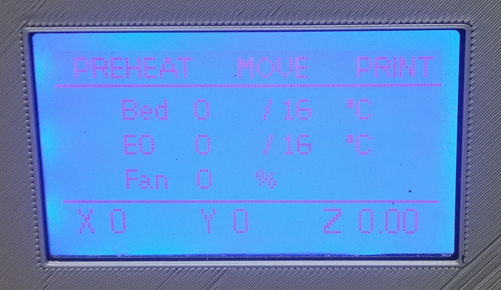

# LPC1768-RepRapFirmware-Files
ReARM config files for using sdavi's port of RepRapFirmware
https://github.com/sdavi/RepRapFirmware

This is an experimental port of dc42's RepRapFirmware) for LPC1768/LPC1769 based boards.

Note: This firmware does not show up as a mass storage device when connected to a computer. Physical access to the internal sdcard may be required in order to revert back or update. More on that later. 

reprap.org forum discussion here- 
https://reprap.org/forum/read.php?147,810214

I am putting my notes here as I go, hopefully to aid someone else and maybe use as a basis for formal documentation later. 

0. READ THIS BEFORE YOU BEGIN! 
  https://duet3d.dozuki.com/Wiki/Firmware_Overview
  
  Pay attention to the bits at the end " Firmware differences from Marlin, Repetier etc" and "Known firmware issues and limitations"
  
  The quick start guide has lots of helpful info too- https://duet3d.dozuki.com/#Section_Quick_Links

1. Get the port. 
  Installing the port is just like loading up Marlin 2.0 or Smoothie. Copy the bin file to the SD card. 
  https://github.com/sdavi/RepRapFirmware/tree/v2-dev-lpc/EdgeRelease
  
  Then grab the closest config file for your board-
  https://github.com/sdavi/RepRapFirmware/tree/v2-dev-lpc/EdgeRelease/ExampleBoardConfig
  
2. Make the folder structrure ont he SD card to organize your configs. Luckily this is well documented here -
  https://duet3d.dozuki.com/Wiki/Firmware_Overview#Section_SD_card_structure
  
3. Edit the example board file and save it to sys/board.txt. I have included mine for REARM here on git for context. 

4. You will need to build your config files depending on your printer type- https://duet3d.dozuki.com/#Section_Firmware_configuration 

5. Use the online configurator - https://configurator.reprapfirmware.org/Start
  Once you get through the config wizard, it will build you a package of 'sys' files to download. Dowload them and put them in the 'sys' folder on the SD card.  

6. Put the card in the board and power up / reset. 
Using something like Octoprint or Printerface look at the terminal output. It should show you that it booted and processed the config files. 

7. Slowly, gently start testing stuff. Depending on your setup, start testing motors and heater. Motors- issue home commands, but be ready to trip the endstops to stop motion. Do them one at a time. Use M114 & M119 to determine position and endstop status. 

8. Here is the tedious part, you can not access the SD card by normal methods yet. I used to be able to mount the SD card via the raspi and read/write the config files on it directly. 
You HAVE to sneakernet it for now... 

9. LCD- documentation and example board file rerefence LCD's - only ST9720 SPI currently supported. 
For REARM, it reads just like Panacutt's info for RRD display (don;t mind Roy's typo saying its for Vicki2) -
scroll doewn to "RRD Full Graphic Smart Display"
http://panucattdevices.freshdesk.com/support/solutions/articles/1000243195-lcd-display-installation

You will have to mod your RRD cables as shown. Its pretty simple to cut the first wire and solder on an extension with a Dupont connector to connect to the board. 

10 Menu files - work in progress. Here are the links I am trying to follow - 

https://duet3d.dozuki.com/Wiki/Duet_2_Maestro_12864_display_menu_system
Greg3d's menus work. I need to tweak the lcd encoder values- my selections jump all over the place. 

https://duet3d.dozuki.com/Wiki/Gcode#Section_M918_Configure_direct_connect_display

TBD: 
Network Interface. Ethernet module from Panacutt seems to be foever out of stock. HOping that an ESP8266 might work in its place, similar to ESP3d. 
